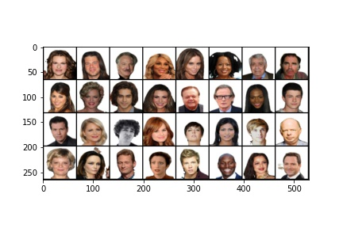
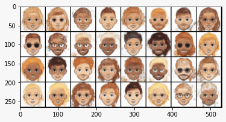

# Avatar Image Generator

   Faces Domain <br/>
   

   Cartoons Domain<br/>
   

   Based on the paper XGAN: https://arxiv.org/abs/1711.05139

## The problem

This repo aims to contribute to the daunting problem of generating a cartoon given the picture of a face.  <br/> <br/>
This is an image-to-image translation problem, which involves many classic computer vision tasks, like style transfer, super-resolution, colorization and semnantic    segmentation. Also, this is a many-to-many mapping, which means that for a given face there are multiple valid cartoons, and for a given cartoon there are multiple valid faces too. </br>

## Datasets

  Faces dataset: we use the VggFace dataset (https://www.robots.ox.ac.uk/~vgg/data/vgg_face/) from the University of Oxford

  Cartoon dataset: we use the CartoonSet dataset from Google (https://google.github.io/cartoonset/), both the versions of 10000 and 100000 items.

## Directory structure

  config.json: contains the model configuration to train/test the model
  weights: contains weights that we save the last time we train the model. The hyperparameters are in config.json

```

├── config.json
├── datasets
│   ├── cartoon_datasets
│   │   ├── cartoonset100k_limited
│   │   │   └── cartoon [15987 entries exceeds filelimit, not opening dir]
│   │   ├── cartoonset100k_limited_df.csv
│   │   ├── cartoonset10k
│   │   │   └── cartoon [10000 entries exceeds filelimit, not opening dir]
│   │   └── cartoonset10k_df.csv
│   ├── face_datasets
│   │   ├── face_images_wo_bg
│   │   │   └── faces [2500 entries exceeds filelimit, not opening dir]
│   │   ├── face_images_wo_bg_permissive
│   │   │   └── faces [2500 entries exceeds filelimit, not opening dir]
│   │   └── vgg_face_dataset
│   │       ├── files [2622 entries exceeds filelimit, not opening dir]
│   │       ├── licence.txt
│   │       └── README
│   └── test_faces
│       ├── generated_cartoon_images
│       ├── input_images
│       │   └── data
│       │       ├── daniel.jpeg
│       │       ├── joel_.jpeg
│       │       └── stev.jpeg
│       └── segmented_images
│           └── data
├── images
│   ├── Cartoons_example.jpeg
│   └── Faces_example.jpeg
├── losses
│   └── __init__.py
├── models
│   └── __init__.py
├── notebooks
│   ├── avatar_model_testing.ipynb
│   └── face_segmentation.ipynb
├── README.md
├── requirements.txt
├── scripts
│   ├── download_faces.py
│   └── plot_utils.py
├── train.py
├── utils
│   └── __init__.py
└── weights
    ├── c_dann.pth
    ├── d1.pth
    ├── d2.pth
    ├── denoiser.pth
    ├── disc1.pth
    ├── d_shared.pth
    ├── e1.pth
    ├── e2.pth
    └── e_shared.pth

```


## The model

   It is based on the XGAN paper omitting the Teacher Loss and adding an autoencoder in the end. The latter was trained to learn well only the representation of the cartoons as to "denoise" the spots and wrong colorisation from the face-to-cartoon outputs of the XGAN.

   The model was trained using the hyperparameters located in config.json. Weights & Biases was used to find the best hyperparameters:

  ```
  wandb login 17d2772d85cbda79162bd975e45fdfbf3bb18911

  ```
  ```
  wandb.init(project="avatar_image_generator")

  ```

  You can see the Weights & Biases report here: https://wandb.ai/stevramos/avatar_image_generator
  
  This is the implementation of [our project](https://madewithml.com/projects/1233/generating-avatars-from-real-life-pictures/) created for the Made With ML Data Science Incubator.
